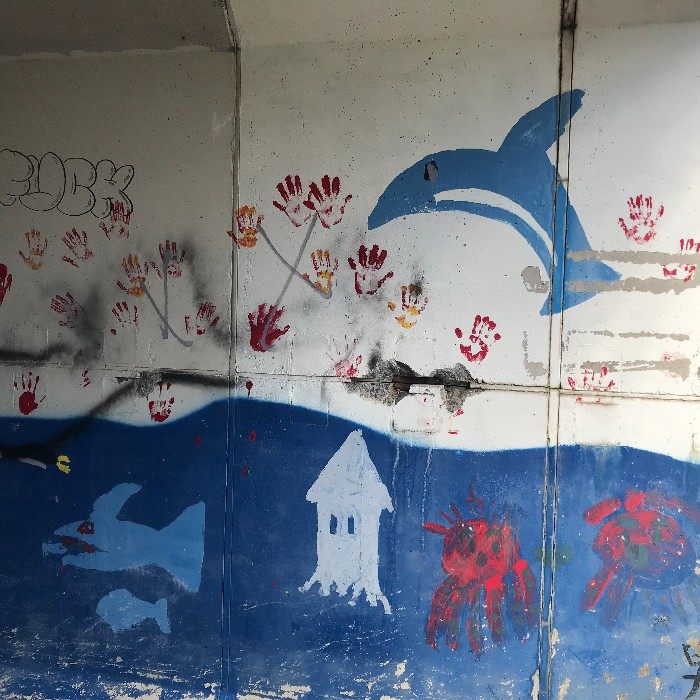

# 于  雨煊 is my name in Chinese

## Where you can find me
- [北海道大学　メディア・観光学院](https://www.imc.hokudai.ac.jp)
- I am a 1st year master's student in the tourism creation course.

## Who am I
- ENTP/ Aries/ Blood type A
- Chinese/ Japanese/ English speaker
> I've recently start to learn French in Duolingo, welcome to exchange language or learning experience with me～
- Totally a tourist
> I like traveling alone the most and I'm very attracted to humanistic landscapes, such as shrines and temples in Japan.
- Other hobbies
> musicals

## What is my recent work
>Recently I have been working on the reaserch about the contents tourism in Japan, and I will be very gald if you want to talk with me about the Hibiya area of Tokyo and [Takarazuka](https://kageki.hankyu.co.jp/)!

## If you want to talk with me
### Please feel free to connect:
- Mail：yuyuxuan0330@gmail.com

